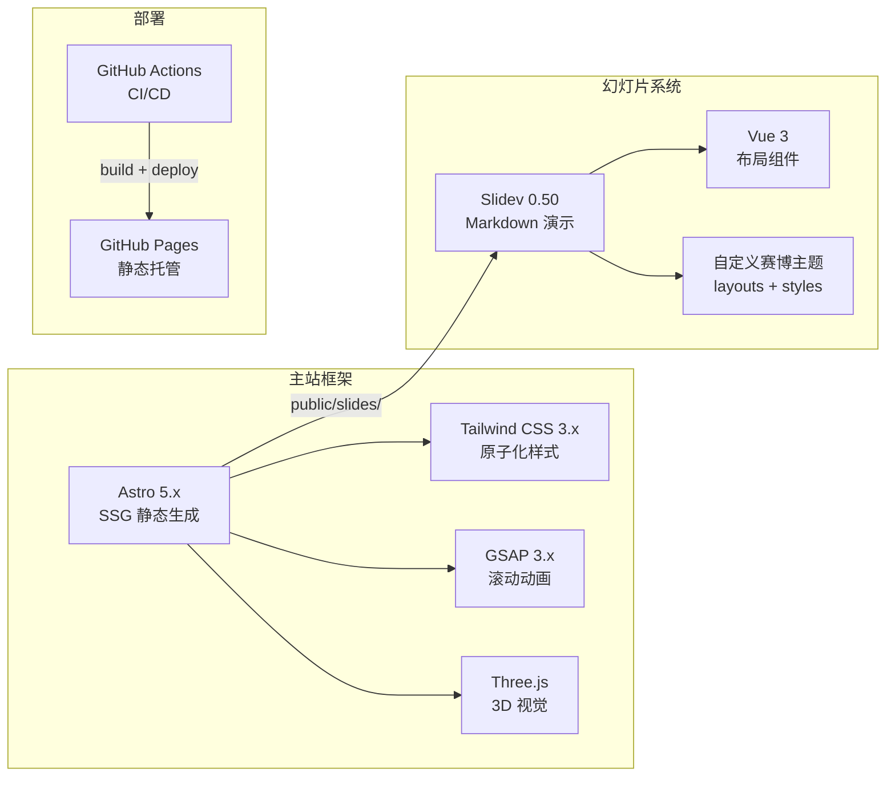
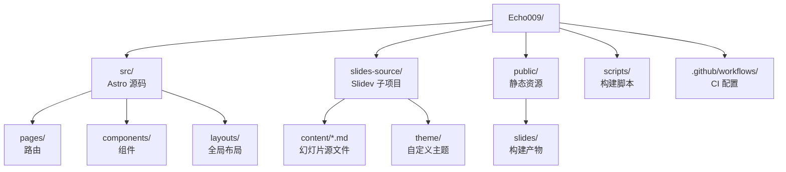
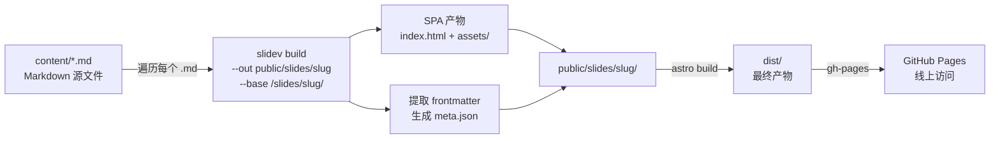
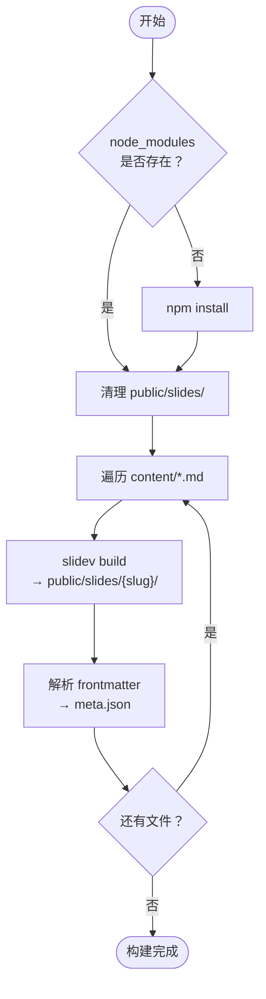
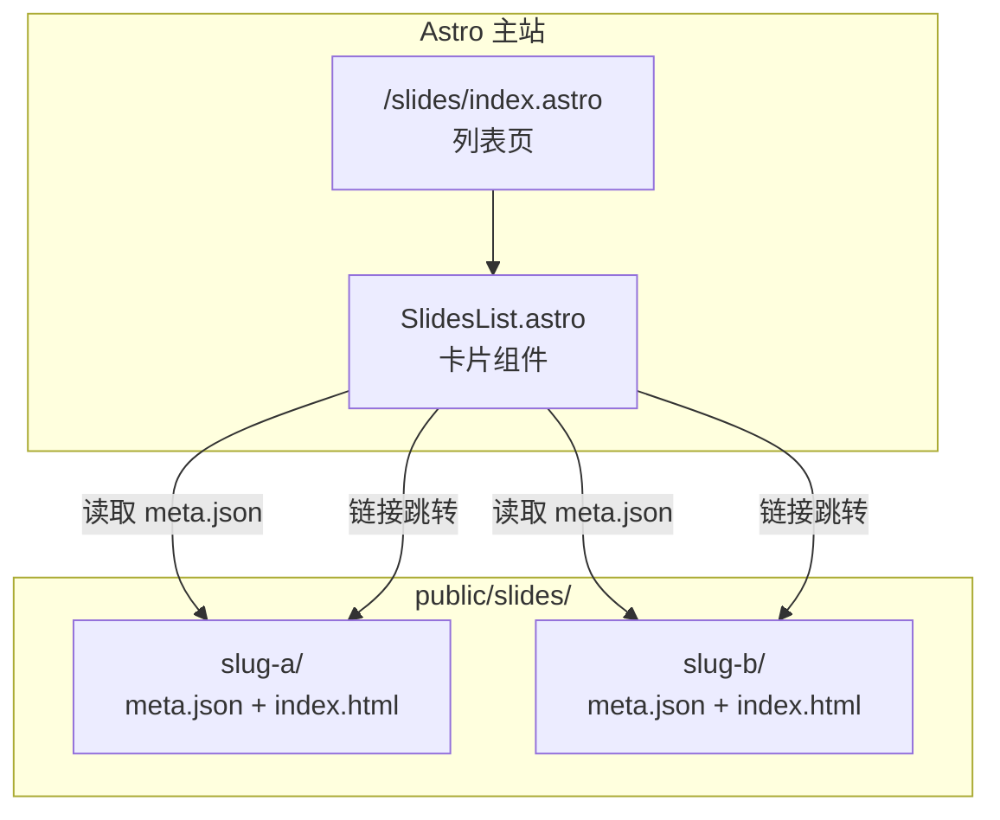
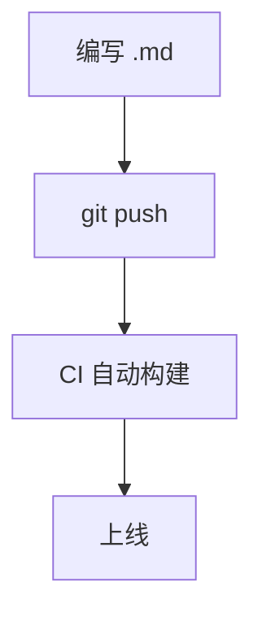

# 赛博朋克个人主页架构解析

---
section: 全景概览
---

# 项目定位

**Echo009** — 赛博朋克美学 × 前端工程实践，托管于 GitHub Pages

<div class="two-col">
  <div>
    <h3>工程亮点</h3>
    <div class="flow">
      <div class="flow-step"><strong>零运行时</strong> — Astro SSG 预渲染，首屏无 JS</div>
      <div class="flow-step"><strong>双系统集成</strong> — Astro 主站 + Slidev 演示，独立构建无缝衔接</div>
      <div class="flow-step"><strong>自研主题</strong> — 6 种布局 + 统一 CSS 变量体系</div>
      <div class="flow-step"><strong>全自动链路</strong> — git push → CI → CDN，零人工干预</div>
    </div>
  </div>
  <div>
    <h3>访问地址</h3>
    <div class="flow">
      <div class="flow-step"><strong>主页</strong> — echo009.github.io</div>
      <div class="flow-step"><strong>幻灯片列表</strong> — /slides</div>
      <div class="flow-step"><strong>单个幻灯片</strong> — /slides/{slug}/</div>
    </div>
  </div>
</div>

---
no: "01"
layout: section-header
subtitle: 技术选型与依赖关系
---

# 技术栈

---
section: 技术栈
---

# 技术全景



<div class="note" style="margin-top: 1rem;">
  <strong>核心选型</strong>：Astro（零 JS 默认，非 Next.js 的全量 hydration） · Slidev（Markdown 即演示，非 reveal.js 的命令式 API） · GSAP（ScrollTrigger 专业级滚动动画）
</div>

---
section: 技术栈
layout: two-col
left: 1
right: 1
---

::left::

# 主站依赖

| 包 | 版本 | 选型理由 |
|---|---|---|
| `astro` | ^5.4 | 零 JS 默认，构建产物纯 HTML |
| `@astrojs/tailwind` | ^5.1 | 原子化样式，快速原型开发 |
| `gsap` | ^3.12 | 专业级动画，ScrollTrigger |
| `three` | ^0.173 | 粒子背景，鼠标交互反馈 |

::right::

# 幻灯片依赖

| 包 | 版本 | 选型理由 |
|---|---|---|
| `@slidev/cli` | ^0.50 | Markdown 驱动，开发者友好 |
| `@slidev/types` | ^0.50 | Vue 组件布局，类型安全 |

<div class="note" style="margin-top: 1.5rem;">
  两套依赖<strong>独立管理</strong>：<br/>
  主站 <code>package.json</code> 与 <code>slides-source/package.json</code> 各自独立安装，互不干扰。
</div>

---
no: "02"
layout: section-header
subtitle: 文件组织与模块划分
---

# 项目结构

---
section: 项目结构
---

# 整体目录



---
section: 项目结构
layout: two-col
left: 1
right: 1
---

::left::

# 主站结构

```
src/
├── pages/
│   ├── index.astro         # 单页滚动首页
│   └── slides/
│       └── index.astro     # 幻灯片列表页
├── components/
│   ├── Hero.astro          # 英雄区
│   ├── SystemProfile.astro # 个人简介
│   ├── TechArsenal.astro   # 技术栈
│   ├── CoreProtocol.astro  # 核心能力
│   ├── NetworkNode.astro   # 社交链接
│   ├── Signal.astro        # 联系方式
│   └── SlidesList.astro    # 幻灯片卡片列表
└── layouts/
    └── Layout.astro        # 全局布局 + CSS 变量
```

::right::

# 幻灯片结构

```
slides-source/
├── package.json            # 独立依赖
├── theme/
│   ├── index.ts            # 主题入口
│   ├── styles/
│   │   └── index.css       # 赛博朋克全局样式
│   └── layouts/
│       ├── cover.vue       # 封面页
│       ├── default.vue     # 默认内容页
│       ├── two-col.vue     # 双栏布局
│       ├── section-header.vue  # 章节标题
│       ├── intro.vue       # 章节分隔页
│       └── cards.vue       # 卡片行布局
└── content/
    └── *.md                # 幻灯片 Markdown
```

---
no: "03"
layout: section-header
subtitle: 从 Markdown 到 SPA 的构建链路
---

# 构建流水线

---
section: 构建流水线
---

# 构建全流程



---
section: 构建流水线
layout: two-col
left: 1
right: 1
---

::left::

# build-slides.sh 流程



::right::

# meta.json 结构

每个幻灯片目录下生成的元数据文件：

```json
{
  "title": "幻灯片标题",
  "date": "2026-05-07",
  "description": "幻灯片描述",
  "cover": ""
}
```

<div class="note" style="margin-top: 1rem;">
  列表页通过扫描 <code>public/slides/</code> 子目录中的 <code>meta.json</code> 读取元信息，按日期<strong>倒序</strong>排列展示。
</div>

---
no: "04"
layout: section-header
subtitle: 主站与幻灯片的衔接机制
---

# 集成机制

---
section: 集成机制
---

# Astro ↔ Slidev 集成架构



---
section: 集成机制
---

# 集成难点：双系统路由桥接

**核心矛盾**：Astro dev server 不认识 Slidev SPA 的内部路由，两个独立系统如何共存？

<div class="two-col">
  <div>
    <h3>解决方案</h3>
    <div class="flow">
      <div class="flow-step"><code>/slides/{slug}</code> → 直接返回对应 <code>index.html</code></div>
      <div class="flow-step"><code>/slides/{slug}/{n}</code> → 302 重定向到 <code>/#/{n}</code></div>
      <div class="flow-step">带扩展名的请求（.js/.css 等）直接放行</div>
    </div>
  </div>
  <div>
    <h3>为什么复杂？</h3>
    <div class="flow">
      <div class="flow-step">Slidev 使用 <strong>hash 路由</strong>（routerMode: hash）</div>
      <div class="flow-step">Astro dev server 路由表里没有 Slidev 的 SPA 页面</div>
      <div class="flow-step">需要 Vite 插件在中间件层手动拦截和分发</div>
    </div>
  </div>
</div>

<div class="note" style="margin-top: 1rem;">
  仅开发模式需要 — 生产环境 Slidev 产物作为纯静态文件由 GitHub Pages 直接服务。
</div>

---
no: "05"
layout: section-header
subtitle: CI/CD 自动化部署
---

# 部署流程

---
section: 部署流程
---

# GitHub Actions 部署流水线

```mermaid
flowchart LR
  Push["git push master"] --> Checkout["actions/checkout@v4"]
  Checkout --> Node["setup-node@v4<br/>Node 22"]
  Node --> NPM["npm ci<br/>主站依赖"]
  NPM --> SlideDeps["cd slides-source<br/>npm install"]
  SlideDeps --> BuildSlides["bash build-slides.sh<br/>构建所有幻灯片"]
  BuildSlides --> BuildAstro["npm run build<br/>构建 Astro"]
  BuildAstro --> Deploy["peaceiris/actions-gh-pages<br/>→ gh-pages 分支"]
  Deploy --> Live["echo009.github.io<br/>上线"]
```



<div class="note" style="margin-top: 1.5rem;">
  <strong>触发条件</strong>：推送到 <code>master</code> 分支 或 手动 <code>workflow_dispatch</code>。<br/>
  部署分支为 <code>gh-pages</code>，使用 <code>force_orphan</code> 保持干净历史。
</div>

---
no: "06"
layout: section-header
subtitle: 赛博朋克视觉设计系统
---

# 主题设计

---
section: 主题设计
---

# 配色体系

复用主站 CSS 变量，保持风格统一：

<div class="chips">
  <span class="chip">--cyber-cyan: #00ffff</span>
  <span class="chip">--cyber-pink: #ff006e</span>
  <span class="chip">--cyber-yellow: #f5ff00</span>
  <span class="chip">--cyber-purple: #7b2fff</span>
</div>

背景使用 `--cyber-black: #050510` 深黑底色

<div class="three-col" style="margin-top: 1rem;">
  <div class="card accent-cyan">
    <h3>主色调 #00ffff</h3>
    <p>标题 · 链接 · 代码<br/>进度条 · 竖线 · 圆点</p>
  </div>
  <div class="card accent-pink">
    <h3>辅助色 #ff006e</h3>
    <p>小标题 · 引用边框<br/>装饰线 · 标签</p>
  </div>
  <div class="card accent-purple">
    <h3>装饰色 #7b2fff</h3>
    <p>渐变过渡 · 分割线<br/>发光效果 · 悬停</p>
  </div>
</div>

---
section: 主题设计
---

# 布局组件

<div class="three-col">
  <div class="card accent-cyan">
    <h3>cover</h3>
    <p>封面页<br/>网格背景 + 角标 + 状态栏</p>
  </div>
  <div class="card accent-pink">
    <h3>default</h3>
    <p>内容页<br/>HUD 顶线 + 侧标签 + 页码</p>
  </div>
  <div class="card accent-purple">
    <h3>two-col</h3>
    <p>双栏布局<br/>左右分栏 + 竖线分割</p>
  </div>
</div>

<div class="three-col" style="margin-top: 1.2rem;">
  <div class="card accent-yellow">
    <h3>cards</h3>
    <p>卡片行<br/>多列卡片 + 强调色边框</p>
  </div>
  <div class="card accent-cyan">
    <h3>intro</h3>
    <p>章节分隔<br/>渐变文字 + 分割线</p>
  </div>
  <div class="card accent-pink">
    <h3>section-header</h3>
    <p>增强版章节头<br/>水印编号 + 渐变标题</p>
  </div>
</div>

---
section: 主题设计
---

# CSS 工具类

<div class="two-col">
  <div>
    <h3>布局工具</h3>
    <div class="flow">
      <div class="flow-step"><strong>.two-col</strong> — 双栏网格布局</div>
      <div class="flow-step"><strong>.three-col</strong> — 三栏网格布局</div>
      <div class="flow-step"><strong>.card</strong> — 通用卡片容器</div>
      <div class="flow-step"><strong>.note</strong> — 注释提示框</div>
    </div>
  </div>
  <div>
    <h3>样式工具</h3>
    <div class="flow">
      <div class="flow-step"><strong>.accent-cyan/pink/...</strong> — 卡片强调色</div>
      <div class="flow-step"><strong>.chips + .chip</strong> — 药丸标签</div>
      <div class="flow-step"><strong>.big-number</strong> — 大号装饰数字</div>
      <div class="flow-step"><strong>.flow + .flow-step</strong> — 流程图</div>
    </div>
  </div>
</div>

---
section: 主题设计
---

# CSS 工程实战

开发主题过程中踩过的坑与解决方案：

<div class="three-col">
  <div class="card accent-cyan">
    <h3>滚动条兼容</h3>
    <p>Chrome 121+ 的 <code>scrollbar-width</code> 会覆盖 <code>::-webkit-scrollbar</code></p>
    <p><strong>解法</strong>：<code>@supports not selector</code> 分流，两套方案互不干扰</p>
  </div>
  <div class="card accent-pink">
    <h3>overflow 混合轴</h3>
    <p><code>overflow-x: visible</code> + <code>overflow-y: auto</code> 无法并存</p>
    <p><strong>解法</strong>：用 padding 给伪元素留空间，保持 <code>overflow: auto</code></p>
  </div>
  <div class="card accent-purple">
    <h3>:has() 条件布局</h3>
    <p>Mermaid 图表页需要纵向居中，但不能影响其他页面</p>
    <p><strong>解法</strong>：<code>.content-area:has(.mermaid)</code> 纯 CSS 实现，零 JS</p>
  </div>
</div>

---
no: "07"
layout: section-header
subtitle: 从创建到发布的完整操作指南
---

# 使用指南

---
section: 使用指南
layout: two-col
left: 2
right: 1
---

::left::

# 添加新幻灯片

在 `slides-source/content/` 下新建 Markdown 文件：

```markdown
---
theme: ../theme
title: 我的分享
date: 2026-05-07
description: 一份关于 XX 的分享
layout: cover
info: 副标题
---

# 我的分享

---

# 第一页内容

这里是正文...
```

::right::

<div class="note">
  Frontmatter 中的 <strong>title</strong>、<strong>date</strong>、<strong>description</strong> 元数据会自动出现在列表页的卡片中。
</div>

<div class="note" style="margin-top: 1rem;">
  文件名即 <strong>slug</strong>，决定了最终访问路径：<br/>
  <code>my-talk.md</code> → <code>/slides/my-talk/</code>
</div>

---
section: 使用指南
layout: two-col
left: 1
right: 1
---

::left::

# 本地开发

```bash
cd slides-source
npx slidev content/my-slide.md
```

热重载开发，实时预览修改效果。

# 一键构建

```bash
bash scripts/build-slides.sh
npm run build
```

::right::

# 部署上线

**自动部署** — 推送到 master 即触发 GitHub Actions



<div class="note" style="margin-top: 1rem;">
  构建脚本自动扫描所有 <code>.md</code> 文件，提取元数据并按日期排序。
</div>

---
layout: cover
---

# 感谢观看
